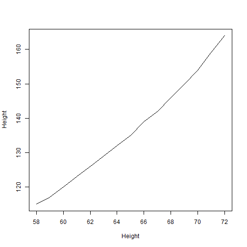
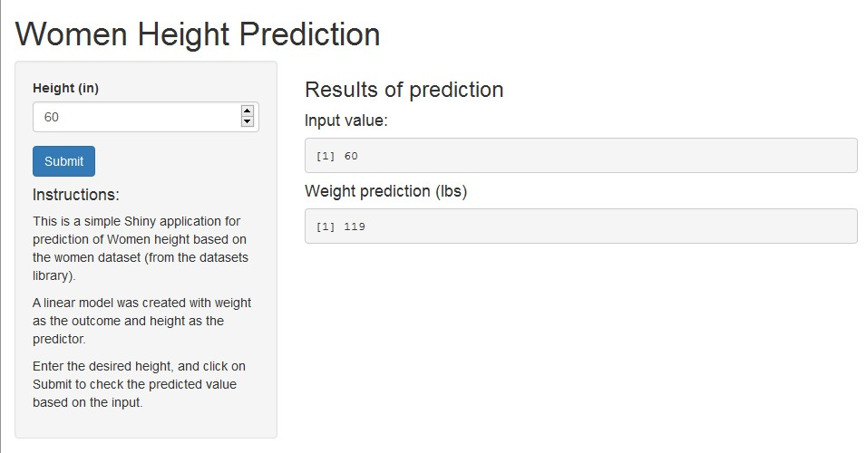

HeigthPred
========================================================
author: Tirza Guerra
date: November 19th, 2015

Women Height Prediction

Overview
========================================================

The goal of this app is to offer an interface for weight prediction of women aged 30-39, based on their heights.

In order to create a model for prediction, we have used the _women_ dataset.

The dataset is a data frame with 15 observations on 2 variables:  

- **height** - numeric Height (in).
- **weight** - numeric Weight (lbs).

Model
========================================================

* A linear model was created as a basis for prediction.  

```
modfit <- lm(weight ~ height, data = women)
```
  
.   

* The new value informed by the user is used to predict the weight.

```
predict(modfit, data.frame(height = newvalue))
```

Data Plot
========================================================

This plot shows the relation of height and weight in the dataset.

 

How To Use
========================================================

Enter the desired height, and click on Submit.

Click here: [HeightPred](https://tirzaguerra.shinyapps.io/HeightPred)
